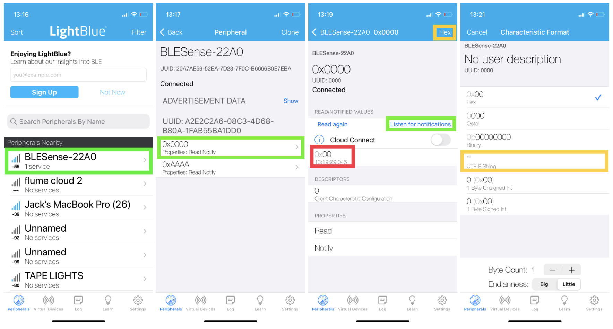
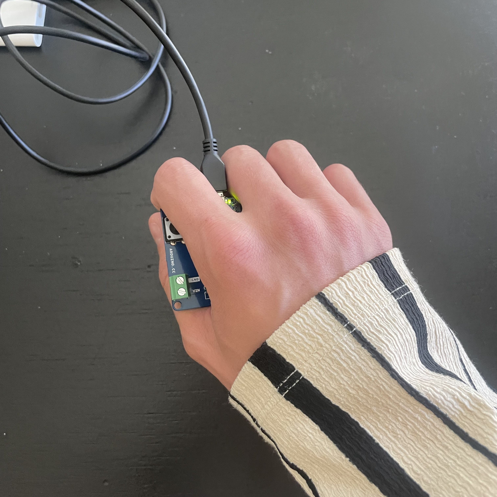

# Run Walk Activity Classifier

## Author
Jack Krammer

Assisting professor: John Oliver

Computer Engineering Senior Project

California Polytechnic State University

June 14, 2024

## Project Overview
This README contains instructions on how to train your own activity classifier model using a provided dataset. The provided dataset contains labeled data on these activities: running, walking, turning right while stationary (standing in place), and turning left while stationary (See Table 1 below for the activity labels). As a result, the trained model will provide inferences (make guesses) on which of these activities the user is performing. 

### Necessary materials
- Arduino Nano 33 BLE Sense (the board)
    - Has the necessary IMU (LSM9DS1) built into the board
- USB to microUSB cable
    - To upload Arduino sketches and provide power to the board
- Computer with Arduino IDE installed and these Arduino libraries installed:
    - Harvard_TinyMLx (version 1.2.2-Alpha or newer)
    - Arduino_LSM9DS1 (version 1.1.0 or newer)
    - ArduinoBLE (version 1.2.1 or newer)
- Phone with a generic Bluetooth® Low Energy (BLE) central app installed
    - LightBlue (iOS or Android)
    - nRF Connect (Android)
- Portable battery (recommended)
    - To power the Arduino Nano 33 BLE Sense while making inferences (i.e. running or walking)
    - Possible to use a computer instead, just might be a little clunky running with the board connected to a computer

### Steps to train and use the model
1. Use the provided colab notebook to train a model on the given dataset.
2. Adjust the provided Arduino C++ files to implement the model.
3. Use the LightBlue (or other generic BLE) app to find the board.
4. Make inferences.
5. Repeat steps to update the model as desired.

More detail on each of these steps is provided below, this is simply the general outline.

## Train the Activity Classifier Model
To train your own custom activity classifier model, follow the steps outlined in this . It is set up so all you have to do is select 'run all' and a model will be generated and trained with the provided dataset. Alternatively, you can update the `Define your Model` section to test a different type of model.

After running all code blocks in that colab notebook, you will have a model that can be used with the Arduino IDE. Download that model (**follow the instructions provided in the very last text block of the colab notebook**) then look at the next section of this readme for the next steps. 

## Adjust Arduino Files
This section describes how to start the Arduino sketch and how to implement the `run_walk.cc` file of the model you just created.

### Create the arduino sketch
Before you can deploy the model, you must first have the Arduino files to implement the model with. First, clone/download this github repository. In Arduino IDE, open the `cpe462_final003.ino` file that is located under the `/src` directory of this github repository. So you don't have to copy all the files around, it is recommended to just navigate to the download location of this github repository and just open the `cpe462_final003.ino` file within the `/src` directory. The `cpe462_final003.ino` file is dependent upon all other files within the `/src` directory, so if you are going to move the location of the `cpe462_final003.ino` file, make sure that all the other files in the `/src` directory are also moved (`ble_uuid.h`, `imu_provider.h`, `rasterize_stroke.cpp`, `rasterize_stroke.h`, `run_walk_model_data.cpp`, `run_walk_model_data.h`).

### Deploy the model to the arduino sketch
Now, to deploy the model you just created, you must replace the existing model data and existing model data length. First, navigate (this can be done within the Arduino IDE) to the `run_walk_model_data.cpp` file in your local location of the cloned/downloaded github repository. Next, replace all the binary data in the `run_walk_model_data.cpp` file with all the binary data in the `run_walk.cc` file. Make sure to only update the binary values and leave the cpp syntax constant. Also, update the value of the `g_run_walk_model_data_len` variable found at the bottom of the `run_walk_model_data.cpp` file with the value of the created model data length (found at the bottom of the `run_walk.cc` file).

### Get new UUIDs for BLE
As there might be other students implementing this project near each other, it is necessary to generate new UUID (universally unique identifier) values to use for BLE. This ensures that each student's board will have a unique identifier, preventing bluetooth connectivity issues. For this project, you only need to generate 1 new UUID value. You can use this <a href="https://www.guidgenerator.com/online-guid-generator.aspx" title="uuid generator">UUID Generator</a> to create this identifer. You also need to create 2 new 16-bit (2 byte) values, but these can be created pretty easily without a generator.

Navigate to the `ble_uuid.h` file in the cloned github repository (this can be done within the Arduino IDE) and replace the UUID values with the new values you generated.

### Upload sketch and record the device name
After all the code is set up, the only thing left to do is record the device name to be able to identify which BLE device is yours. To do so, open the serial monitor and upload the `cpe462_final003.ino` sketch to the board. Record the device name printed on the serial monitor next to `"BLE name (RECORD THIS NAME) = "`. This is the name of the device that can be seen on the main page of any generic BLE central app (i.e. LightBlue) installed. No need to worry about the uniqueness of this name, as this value is determined from the MAC address of the board and given a room of 30 students, there is a very low chance that two students will have a board with the same printed device name.

## Powering the Board
At this point, all the code required is uploaded to the board and inferences will start to be generated. There are two ways to read the inferences.
1. Keeping the board **plugged into a computer** and reading the results over the serial monitor (possible, but might be challenging to perform the running activity with a computer).
2. Use an **external battery** (i.e. portable charger) to power the board and using a BLE app (i.e. LightBlue) on your phone to read the results. 

### Using a computer as a power source
When using a computer as the power source for the board, there are advantages and disadvantages. One advantage is that a rasterized image representing the current activity will be printed over serial along with the label of the data (see Table 1 below) and the score of confidence in the inference (-128 = lowest confidence, 127 = highest confidence). However, using a computer means that the board must be tethered, so performing activities may be difficult or cause issues with inferences. For this reason, I recommend using an external battery and connecting a phone over BLE. Also, I thought it was kinda cool to use bluetooth.

### Using an external battery as a power source
When using an external battery as a power source, there are a couple of extra steps required.

1. Adjust the Arduino sketch to not wait for the serial monitor.

    1. Navigate to the `cpe462_final003.ino` file.
    2. Comment out line 79 (`while(!Serial);`).
        - As a portable battery does not usually implement serial connections, this prevents the sketch from waiting until a serial connection is made.
    3. Upload the updated sketch to the board.

2. Swtich the board to be powered by an external battery (i.e. portable charger).

3. Download a BLE app (i.e. LightBlue) and use the device name to find the board in the device list.

### Using LightBlue
This section provides a little insight into the LightBlue app. Lightblue is one of the app options for BLE connectivity between the board and your phone. 

**Figure 1.** An example usage of the LightBlue app for BLE connectivity.

- Starting with the far left image, this illustrates the list of peripherals available for BLE connectivity. 
    - Scroll to find the device that matches the device name that you recorded earlier. 
    - This device name should differ from the device name in the example (BLESense-22A0). 

- Next, the left middle image illustrates the list of available characteristics for each service available. 
    - For this project, there is one service (`BLE_UUID_ACTIVITY_SERVICE`) and two characteristics (`BLE_UUID_LABEL` and `BLE_UUID_SCORE`) under that service. 
    - The values for each of these UUIDs were defined earlier. Check your `ble_uuid.h` file to confirm you have the correct device (each device should be configured with a unique set of UUIDs).
    - Select the characteristic with the UUID that matches your `BLE_UUID_LABEL` value (0x0000 in this example).

- Next, the right middle image illustrates the details of the `BLE_UUID_LABEL` characteristic.
    - The red box identifies the label of the inference made. These will collect with the most recent inference value at the top.
    - Select the 'Listen for notifications' button to have the label of each inference automatically received by your phone (i.e. instead of pressing the 'Read again' button each time you want to check).
    - The yellow box identifies the current format of the values received. Select this button to bring the menu illustrated in the far right image.

- Lastly, the far right image illustrates the options for the format of the values received. 
    - Select whichever format you like best.
    - I find it easiest to use the UTF-8 or hex representation.

## Make Inferences with the Model
Activities are automatically detected. The board does this by assuming that every pause in motion (i.e. a period of time with a lack in significant IMU accelerometer data) is a marker of a new activity being started or an activity being completed. As a result, at every pause, or every detected pause, the board will make an inference on the prior period of activity. This is not perfect, but what this means is that the user does not have to do anything before performing an activity. The user should simply pause, perform the activity, pause, and then look at the result of the model's inference. If a result did not appear, or many different results appeared, simply restart and perform the activity again. Through testing, I have found that performing the activity for a shorter duration (i.e. 5 steps or so) tends to work best with this method of making inferences.

To make proper inferences, the ***hand positioning MUST be correct***. Refer to the figure below for the proper way to hold the board. As the whole dataset was trained with the board in this position, all activities performed must also have the user's hand in this position for the inferences to be valid. 

**Figure 2.** The user should use their right hand to hold the board and have the USB to microUSB cable pass between the user's right pointer finger and the right middle finger. When walking, the user should have their right hand at their side and swing their arms like they usually would (might be a little weird when holding a computer in the other hand). When running, the user should have their right arm up and bent at the elbow, like they usually would if they were running (again, might be a little weird when holding a computer in the other hand).

### Activity labels
These labels correspond to the outputs of the model when the provided dataset is used.

|            Activity            | Label (hex)  | Label (UTF-8) |
| ------------------------------ | :----------: | :-----------: |
| turning left while stationary  |     0x31     |      "1"      |
| walking                        |     0x32     |      "2"      |
| turning right while stationary |     0x33     |      "3"      |
| running                        |     0x34     |      "4"      |

**Table 1.** This table identifies the labels that are printed for each inference made by the model. This table is only valid if the provided dataset is used. By default, the serial monitor will print the labels in UTF-8, whereas by default, the LightBlue BLE app will display the labels in hexadecimal format.

### Important note
This dataset was only created with one person performing the activities. As a result, the models created could be overfit to that person and not translate well to others. Future work involves improving the provided dataset by gathering more data from different people. Future work also includes adding more activities to the dataset, increasing the number of activities these models can classify.

## Helpful Links
Here are a few links to help with the process of training and using this model.
- 
- <a href="https://www.guidgenerator.com/online-guid-generator.aspx" title="uuid generator">UUID Generator</a>
- <a href="https://docs.arduino.cc/hardware/nano-33-ble-sense/" title="Arduino Nano 33 BLE Sense documentation">Arduino Nano 33 BLE Sense Documentation</a>
- <a href="https://www.arduino.cc/reference/en/libraries/arduinoble/" title="Arduino BLE info">Arduino BLE Info</a>
- <a href="https://github.com/tinyMLx/appendix/blob/main/BLEOverview.md" title="additional BLE info">Additional BLE Info</a>
- <a href="https://tinyml.seas.harvard.edu/magic_wand/" title="dataset generator">Dataset Generator</a>

